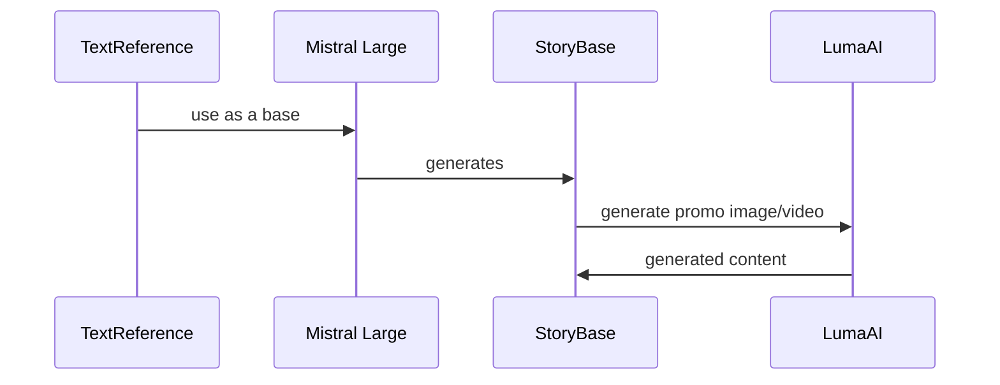
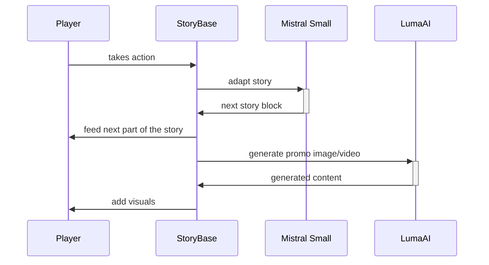

# Project: Alternative Stories

Submission for the [London, Paris, Berlin AI HackXelerator hackathon](https://www.kxsb.org/lpb25).

See the [project video](https://vimeo.com/1077755227/cafc9c4300?share=copy)

## Architecture

### Story Foundations

### Story Adaption

